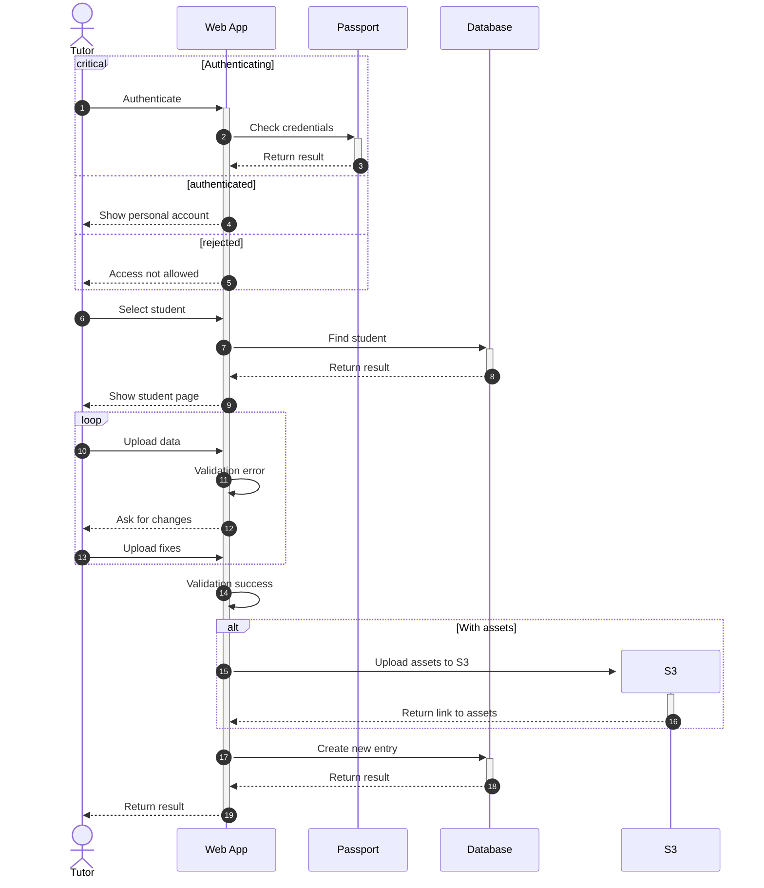

```mermaid
sequenceDiagram
autonumber
    actor T as Tutor
    participant W as Web App
    participant P as Passport
    participant D as Database
    critical Authenticating 
    T ->>+ W: Authenticate
    W ->>+ P: Check credentials
    P -->>- W: Return result
    option authenticated
        W-->>T: Show personal account
    option rejected
        W-->>T: Access not allowed
    end
    T ->> W: Select student
    W ->>+ D: Find student
    D -->>- W: Return result
    W -->> T: Show student page
    loop
    T ->> W: Upload data
    W ->> W: Validation error

    W -->> T: Ask for changes
    T ->> W: Upload fixes
    end
    W ->> W: Validation success
    alt With assets
    create participant S as S3
    W ->>+ S: Upload assets to S3
    S -->>- W: Return link to assets
    end
    W ->>+ D: Create new entry
    D -->>- W: Return result
    W -->>- T: Return result
```