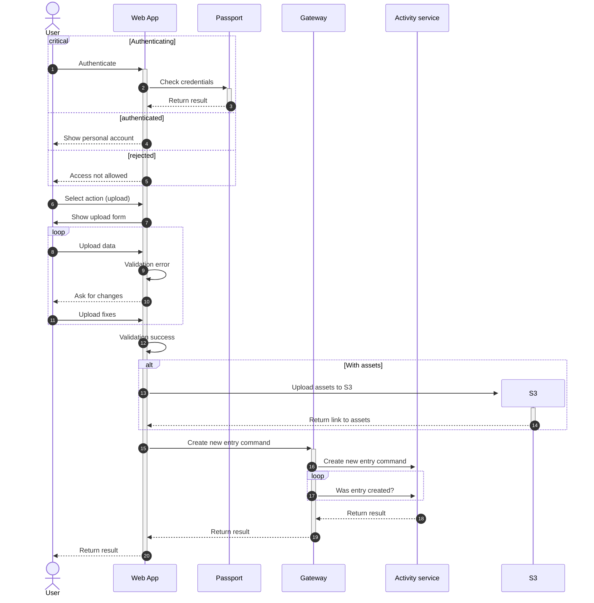

```mermaid
sequenceDiagram
autonumber
    actor T as User
    participant W as Web App
    participant P as Passport
    participant G as Gateway
    participant A as Activity service
    critical Authenticating 
    T ->>+ W: Authenticate
    W ->>+ P: Check credentials
    P -->>- W: Return result
    option authenticated
        W-->>T: Show personal account
    option rejected
        W-->>T: Access not allowed
    end
    T ->> W: Select action (upload)
    W ->> T: Show upload form
    loop
    T ->> W: Upload data
    W ->> W: Validation error
    W -->> T: Ask for changes
    T ->> W: Upload fixes
    end
    W ->> W: Validation success
    alt With assets
    create participant S as S3
    W ->>+ S: Upload assets to S3
    S -->>- W: Return link to assets
    end
    W ->>+ G: Create new entry command
    G ->>+ A: Create new entry command
    loop
    G ->>+ A: Was entry created?
    end
    A -->> G: Return result
    G -->>- W: Return result
    W -->>- T: Return result
```